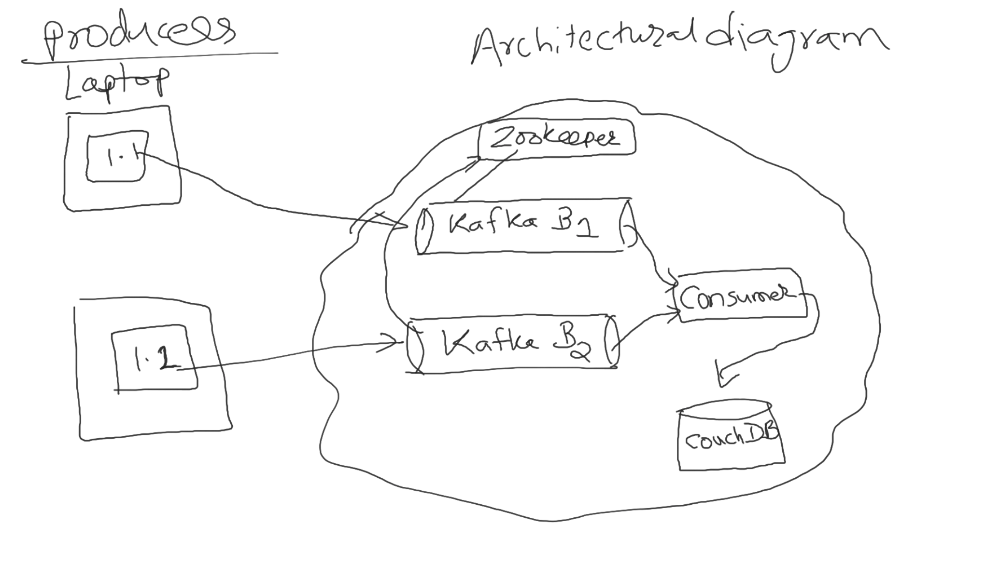
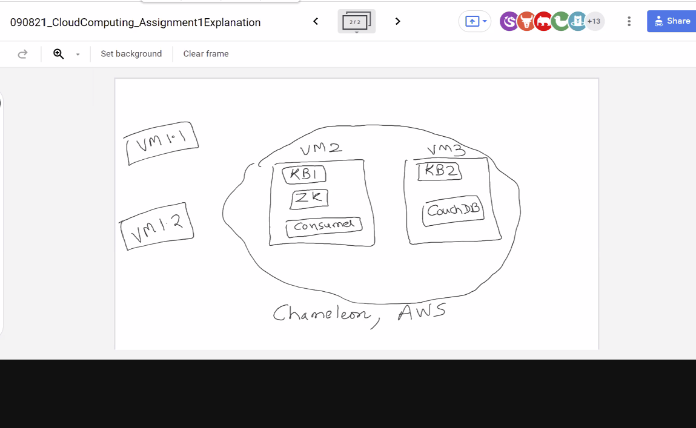

# CS 5287: Principles of Cloud Computing
## Programming Assignment 1
Programming assignment 1 for Vanderbilt University's CS 5287: Principles of Cloud Computing

This project uses [kafka-python](https://pypi.org/project/kafka-python/), a Python client for the [Apache Kafka](https://kafka.apache.org/), "an open-source distributed event streaming platform used by thousands of companies for high-performance data pipelines, streaming analytics, data integration, and mission-critical applications".

The goal of the project is to gain experience implementing a data pipeline using clustered cloud architecture. We aim to implement a pipeline with the architecture shown in the image below:

Each team member will be able to run their own **Kafka Producer** on their own local VM (Ubuntu 20.04) within VirtualBox. Each producer will send stock market-related data (namely a stream of the current price) into the 2-node Kafka cluster in the cloud in which two brokers will run, each on their own Cloud VM. **One** of the cloud VMs will run a **Kafka Consumer** process which will consume, or receive, the produced messages from the Kafka Brokers. While consuming, the Consumer will further pipe the data into a **data sink**, which will just be a [CouchDB](https://couchdb.apache.org/) database. In a later stage, an intermediary step of processing will be added between the consumer and the data sink using Apache Spark. Here is another high level architectural diagram that shows which services/processes we intend to run on which host:

We intend to run one producer on each team member's local VirtualBox VM, and we intend to lay out the processes for the Cloud VMs as follows:

- VM1
  - Kafka Broker id=0
  - Zookeeper (i.e. cluster bootstrap server)
  - Consumer (Python process )
- VM2
  - Kafka Broker id=1
  - CouchDB

### Milestones
#### Milestone 1 - Due 9/15/2021
- [Documentation](milestones/M1README.md)
- [Video](https://www.youtube.com/watch?v=TflXLZmG7cA)
#### Milestone 2 - Due 9/22/2021
- [Documentation](milestones/M2README.md)
- [Video](https://www.youtube.com/watch?v=wKBLXW1JScE)
#### Milestone 3 - Due 9/29/2021
- [Documentation](milestones/M3README.md)
- [Video](https://youtu.be/crXXRN27cIg)
